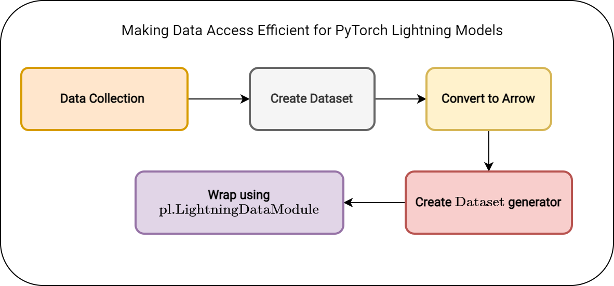

# Efficient Modeling with PyTorch Lightning & PyArrow

The structure of the project is as follows:
```
PROJECT_HOME
├── checkpoints
│   ├── image-classifier-epoch=05-val_loss=0.08.ckpt
│   ├── image-classifier-epoch=06-val_loss=0.07.ckpt
│   └── last.ckpt
├── data
│   ├── test
│   └── train
├── data_parquet
│   ├── test
│   └── train
├── dataset
│   ├── convert_data2pyarrow.py
│   ├── custom_dataset.py
│   ├── data_module.py
│   ├── __init__.py
├── lightning_logs
│   ├── version_0
│   ├── version_1
├── networks
│   └── resnet50.py
├── README.md
└── test_logs.csv
```

In this project, we use `resnet50` which classifies `dogs` and `cats`.  This is to simply understand the flow of efficient modeling and training the `PyTorch Lightning` models after converting the data to `Apache Arrow` format using `PyArrow`.

### Why Apache Arrow?
Apache Arrow helps enable efficient data access by providing a standardized columnar in-memory data format that allows for fast and direct access to data elements, eliminating the need for expensive data serialization and deserialization operations. This format improves data locality, compression, and vectorized processing, resulting in accelerated data access and improved performance for data-intensive tasks.

It also helps with distributed training by providing an efficient and standardized in-memory data format that allows for seamless data interchange between different nodes in a distributed computing environment, reducing data transfer overhead and enabling faster and more scalable training.

### Steps for creating `pl.LightningDataModule` 


Run the following code to convert the data to Arrow
```
$python dataset/convert_data2pyarrow.py
```

### Training & Evaluating
Training and evaluating the model is same as other pytorch lightning models.


For distributed training, modify the training code with this:
```
trainer = Trainer(devices=2, nodes=2, accelerator="gpu", strategy="ddp", max_epochs=10, precision="16-mixed",
                      callbacks=[checkpoint_callback])
```

### Credits

Dataset used in this project is collected from `https://www.kaggle.com/competitions/dogs-vs-cats/data`. 